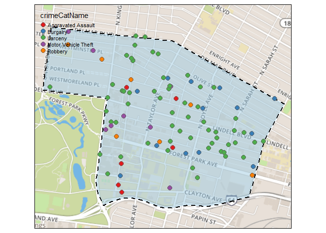

Saint Louis City Crime Data - Monthly Reports
================
Jes Stevens, M.A.
(September 13, 2019)

Introduction
------------

[Washington University Medical Center Redevelopment Corporation](http://wumcrc.com) is a partnership between BJC Health Care and Washington University School of Medicine and works to improve the quality of life for the neighborhoods surrounding the medical campus. In order to achieve this goal in Forest Park Southeast and the Central West End , WUMCRC has invested millions of dollars toward regenerating the market for private investment in businesses and real estate, enhancing human and social service opportunities, and improving the level of physical and personal security.

One way we work to improve the level of physical & personal security is the analysis and distribution of data. The original source of this crime data is <http://slmpd.org/crimereports.shtml>. This notebook uses primarily `compstatr` to access and clean the crime data.

R Markdown
----------

Tidy data
---------

### Create an Index

``` r
i <- cs_create_index()
```

### Get Data - 2019

``` r
update <- cs_last_update()
update <- strsplit(update, " ")[[1]]
c_month <- update[[1]]
c_year <- as.numeric(update[[2]])
yearList19 <- cs_get_data(year = c_year, index = i)
```

### Download Current Month

``` r
cs_validate(yearList19, year = 2019)
```

    ## [1] TRUE

``` r
totalCrimes19 <- cs_collapse(yearList19)
```

``` r
print(c_month)
```

    ## [1] "August"

``` r
crimes19 <- cs_extract_month(yearList19, month = "August")
```

### Clean & Categorize Data - 2019

`cs_filter_count` removes negative counts. Negative counts, -1, in the count column means that the crime, or charge in this specific observation has either been deemed unfounded, or the crime has been up coded. We do not want to map this data.

Many of the analyses we conduct include comparisons between violent & non-violent crime, comparisons on the amount of crimes happening in each crime cateogy over time, and if crimes occur during the day or at night. The following code ceates variables to conduct these analyses.

`cs_crime_cat` creates a variable with the names of the crime.

`cs_crime` creates a logic variable and codes violent crimes as `TRUE` and non-violent crimes as `FALSE`

`cs_parse_date` creates two columns separating the `Date Occur` variable. The two colums are as follows: one contains the date - month, date, and year, and the other contains the hour and minute. This is used because crimes coded in the most recent month, can contain dates that occured, in previous months or years & in this report we only want to map the crimes that occured in the past month.

`filter` is a `dplyr` function that filters out any dates that occur before the our selected date, and also filters out crimes that did not happen in either District 2 or district 5.

`mutate` adds a variable that codes and labels the days of the week for each crime that occurred, and creates another time of day variable

``` r
tidyCrimes19 <- crimes19 %>% 
  cs_filter_count(., var = count) %>%
  cs_filter_crime(., var = crime, "part 1") %>%
  cs_crime_cat(., var = crime, crimeCatNum, "numeric") %>%
  cs_crime_cat(., var = crime, crimeCatName, "string") %>%
  cs_crime(., var = crime, violent, "violent") %>%
  cs_crime(., var = crime, property, "property") %>%
  cs_parse_date(., date_occur, dateVar = dateOcc, timeVar = timeOcc) %>%
  filter(dateOcc >= as.Date("2019-08-01")) %>%
  filter(district == 2 | district == 5) %>%
  mutate(weekday = wday(dateOcc, label = TRUE)) %>%
  mutate(tod = timeOcc)
```

`strptime` and `format` takes the new time variable and formats it to a character so that we can determine if the crime occured at day or at night, and creates a second coded variable that labels each observations as day or night based on the newly formated time variable.

`select` drops the unneeded variables.

`cs_missing_XY` determines what data does not have x & y coordinates, and therefore cannot be accurately mapped.

`cs_replace0` replaces missing x & y coordinates with `NA`, and drops the missing data.

``` r
tidyCrimes19$tod <- strptime(tidyCrimes19$tod, tz = "America/Chicago", "%H:%M")
tidyCrimes19$tod <- format(tidyCrimes19$tod, format = "%H%M%S")

tidyCrimes19 <- tidyCrimes19 %>%
  mutate(., dayNight = ifelse(tod >= "180000" & tod < "600000", "Night", "Day")) %>% 
  select(-dateTime, -tod, -flag_crime, -flag_administrative, -flag_unfounded, -flag_cleanup)

tidyCrimes19 <- cs_missingXY(tidyCrimes19, varX = x_coord, varY = y_coord, newVar = missing)
table(tidyCrimes19$missing)
```

    ## 
    ## FALSE  TRUE 
    ##   735     4

``` r
tidyCrimes19 <- tidyCrimes19 %>% 
  cs_replace0(., var = x_coord) %>%
  cs_replace0(., var = y_coord) %>% 
  filter(., missing == FALSE)
```

### Get Data - 2018

``` r
yearList18 <- cs_get_data(year = 2018, index = i)
```

### Data Preperation

``` r
cs_validate(yearList18, year = 2018)
```

    ## [1] TRUE

### Download Last Year's Month

``` r
totalCrimes18 <- cs_collapse(yearList18)
crimes18 <- cs_extract_month(yearList18, month = "August")
```

### Clean & Categorize Data - 2018

``` r
tidyCrimes18 <- crimes18 %>% 
  cs_filter_count(., var = count) %>%
  cs_filter_crime(., var = crime, "part 1") %>%
  cs_crime_cat(., var = crime, crimeCatNum, "numeric") %>%
  cs_crime_cat(., var = crime, crimeCatName, "string") %>%
  cs_crime(., var = crime, violent, "violent") %>%
  cs_crime(., var = crime, property, "property") %>%
  cs_parse_date(., date_occur, dateVar = dateOcc, timeVar = timeOcc) %>%
  filter(dateOcc >= as.Date("2018-08-01") & dateOcc <= as.Date("2018-08-31")) %>%
  filter(district == 2 | district == 5) %>%
  mutate(weekday = wday(dateOcc, label = TRUE)) %>%
  mutate(tod = timeOcc)

tidyCrimes18$tod <- strptime(tidyCrimes18$tod, tz = "America/Chicago", "%H:%M")
tidyCrimes18$tod <- format(tidyCrimes18$tod, format = "%H%M%S")

tidyCrimes18 <- tidyCrimes18 %>%
  mutate(., dayNight = ifelse(tod >= "180000" & tod < "600000", "Night", "Day")) %>% 
  select(-dateTime, -tod, -flag_crime, -flag_administrative, -flag_unfounded, -flag_cleanup)

tidyCrimes18 <- cs_missingXY(tidyCrimes18, varX = x_coord, varY = y_coord, newVar = missing)
table(tidyCrimes18$missing)
```

    ## 
    ## FALSE  TRUE 
    ##   747     9

``` r
tidyCrimes18 <- tidyCrimes18 %>% 
  cs_replace0(., var = x_coord) %>%
  cs_replace0(., var = y_coord) %>% 
  filter(., missing == FALSE)
```

### Combine 2018 & 2019

``` r
augustCrimes <- rbind(tidyCrimes18, tidyCrimes19)
```

### Create Spatial Objects

``` r
crimes18_sf <- cs_projectXY(tidyCrimes18, varX = x_coord, varY = y_coord)
crimes19_sf <- cs_projectXY(tidyCrimes19, varX = x_coord, varY = y_coord)
augustCrimes_sf <- cs_projectXY(augustCrimes, varX = x_coord, varY = y_coord)
```

### Prep for Data by Neighborhood

``` r
sa <- c(39,28,38,51,53,54,58,46,47,48,48)
dst2 <- c(7:15,27:39,40:45,81,82,87,88)
dst5 <- c(34,46:58,78)
```

Mapping
-------

One way we work to improve the level of physical & personal security is the analysis and distribution of crime data and statistics. The original source of this crime data is <http://slmpd.org/crimereports.shtml>. This notebook takes the data that was previously cleaned and maps the data.

Load Spatial Data
-----------------

### Coordinates

``` r
# Service Area Neighborhood Coordinates 
xyfpse <- c(-90.2679, -90.2423, 38.6176, 38.6334)
xycwe <- c(-90.2759, -90.2368, 38.6286, 38.6552)
xybot <- c(-90.2596, -90.2359, 38.6165, 38.6291)
xydbp <- c(-90.2869, -90.2726, 38.6433, 38.6566)
xysdb <- c(-90.3026, -90.2827, 38.6456, 38.6571)
xywe <- c(-90.3020, -90.2712, 38.6517, 38.6710)
xyvp <- c(-90.2803, -90.2712, 38.6517, 38.6622)
xyac <- c(-90.2744, -90.2609, 38.6505, 38.6661)
xyfp <- c(-90.2648, -90.2543, 38.6493, 38.6655)
xylp <- c(-90.2588, -90.2437, 38.6481, 38.6624)
xyvd <- c(-90.2520, -90.2304, 38.6426, 38.6585)
```

### Open Street Map from Mapbox - Basemap Tile Imagery

### Spatial Data from the City Of St. Louis

``` r
nhoods_sf <- gw_get_data("Neighborhoods", "sf")
sa_sf <- nhoods_sf %>% 
  filter(., NHD_NUM %in% sa)
```

### FPSE, BOT, CWE, MC

#### Map Creation

##### FPSE

``` r
fpse_total <- tm_shape(fpse_tiles) +
  tm_rgb() +
  nhoods_sf %>%
  filter(., NHD_NUM == 39) %>% 
  tm_shape() +
    tm_fill(col = "#9ecae1", 
            alpha = .5) +
    tm_borders(col = "black", 
               lwd = 2, 
               lty = "dashed") +
  filter(crimes19_sf, 
         neighborhood == 39) %>%
  tm_shape() +
    tm_bubbles(size = .25, 
               col = "crimeCatName", 
               palette = "Set1", 
               title.col = "Part 1 Crimes") +
  tm_layout(
    frame = FALSE,
    legend.bg.color = "white", 
    legend.frame=TRUE,
    legend.outside = FALSE,
    legend.position = c("right", "bottom"))

fpse_total
```


``` r
fpse_dn <- tm_shape(fpse_tiles) +
  tm_rgb() +
  nhoods_sf %>%
  filter(., NHD_NUM == 39) %>% 
  tm_shape() +
    tm_fill(col = "#9ecae1", 
            alpha = .5) +
    tm_borders(col = "black", 
               lwd = 2, 
               lty = "dashed") +
  filter(crimes19_sf, 
         neighborhood == 39) %>%
  tm_shape() +
    tm_bubbles(size = .25, 
               col = "dayNight", 
               palette = "-RdBu", 
               title.col = "Time of Crimes") +
  tm_layout(
    frame = FALSE,
    legend.bg.color = "white", 
    legend.frame=TRUE,
    legend.outside = FALSE,
    legend.position = c("right", "bottom"))

fpse_dn
```


``` r
fpse_vlnt <- tm_shape(fpse_tiles) +
  tm_rgb() +
  nhoods_sf %>%
  filter(., NHD_NUM == 39) %>% 
  tm_shape() +
    tm_fill(col = "#9ecae1", 
            alpha = .5) +
    tm_borders(col = "black", 
               lwd = 2, 
               lty = "dashed") +
  filter(crimes19_sf, 
         neighborhood == 39) %>%
  tm_shape() +
    tm_bubbles(size = .25, 
               col = "violent", 
               palette = "Reds", 
               title.col = "Violent") +
  tm_layout(
    frame = FALSE,
    legend.bg.color = "white", 
    legend.frame=TRUE,
    legend.outside = FALSE,
    legend.position = c("right", "bottom"))

fpse_vlnt
```


##### CWE

``` r
# This Code is incomplete

cwe_total <- tm_shape(cwe_tiles) +
  tm_rgb() +
  nhoods_sf %>%
  filter(., NHD_NUM == 38) %>% 
  tm_shape() +
    tm_fill(col = "#9ecae1", alpha = .5) +
    tm_borders(col = "black", lwd = 2, lty = "dashed") +
  filter(crimes19_sf, neighborhood == 38) %>%
  tm_shape() +
    tm_bubbles(size = .25, col = "crimeCatName", palette = "Set1")


cwe_total
```



``` r
tmap_save(cwe_total, file = "cwe_total_crimes.jpeg", dpi = 500)
```

    ## Warning in png(tmp, width = width, height = height, res = res): 'width=7,
    ## height=7' are unlikely values in pixels

    ## Map saved to G:\Projects\Safety-Security\r-crime-mapping\src\notebooks\cwe_total_crimes.jpeg

    ## Resolution: 3750.461 by 3266.265 pixels

    ## Size: 7.500921 by 6.532531 inches (500 dpi)

### Save Maps

``` r
tmap_save(fpse_total, file = here("data/results/2019/august/fpse/fpse_total_crimes.jpeg"), dpi = 500)
```

    ## Warning in png(tmp, width = width, height = height, res = res): 'width=7,
    ## height=7' are unlikely values in pixels

    ## Map saved to G:\Projects\Safety-Security\r-crime-mapping\data\results\2019\august\fpse\fpse_total_crimes.jpeg

    ## Resolution: 3935.393 by 3112.777 pixels

    ## Size: 7.870785 by 6.225554 inches (500 dpi)

``` r
tmap_save(fpse_dn, file = here("data/results/2019/august/fpse/fpse_day_night.jpeg"), dpi = 500)
```

    ## Warning in png(tmp, width = width, height = height, res = res): 'width=7,
    ## height=7' are unlikely values in pixels

    ## Map saved to G:\Projects\Safety-Security\r-crime-mapping\data\results\2019\august\fpse\fpse_day_night.jpeg

    ## Resolution: 3935.393 by 3112.777 pixels

    ## Size: 7.870785 by 6.225554 inches (500 dpi)

``` r
tmap_save(fpse_vlnt, file = here("data/results/2019/august/fpse/fpse_vlnt.jpeg"), dpi = 500)
```

    ## Warning in png(tmp, width = width, height = height, res = res): 'width=7,
    ## height=7' are unlikely values in pixels

    ## Map saved to G:\Projects\Safety-Security\r-crime-mapping\data\results\2019\august\fpse\fpse_vlnt.jpeg

    ## Resolution: 3935.393 by 3112.777 pixels

    ## Size: 7.870785 by 6.225554 inches (500 dpi)
