```{r setup, include=FALSE}
knitr::opts_chunk$set(echo = TRUE)
```

```{r Load Dependencies and Data, include = FALSE}
# tidyverse packages
library(ggplot2)       # plotting data
library(stringr)       # wrappers for common string operations
library(tidyr)         # tidy data
library(dplyr)         # data manipulation
library(magrittr)      # pipe operator
library(readxl)        # read & write excel files
library(lubridate)     # time data manipulation
library(scales)

# spatial packages
library(tmap)         # map layouts
library(tmaptools)    # tools for handeling spatial 
library(oldtmaptools) # deprecated toolds for spatial analysis
library(sf)           # spatial data tools
library(ceramic)      # download online imagery tiles
library(compstatr)    # tools for STL crime data
library(raster)       # geograpic data analysis & modeling

# other packages
library(here)         # file path management
library(janitor)      # tools for examining data
library(RColorBrewer) # cynthia brewer color palettes
library(viridis)      # color palettes
library(kableExtra)   # exporting pretty tables
library(htmltools)
library(skimr)

# load data 
load(file = here("data", "basemap-files", "mapbox-tiles.rda"))
load(file = here("data", "basemap-files", "boundaries.rda"))
load(file = here("data", "crime-data.rda"))
load(file = here("data", "spatial-crime-data.rda"))
load(file = here("data", "nbhd_pop10.rda"))
load(file = here("data", "basemap-files", "nbhd-boundaries.rda"))
```

## Summary Notes: FPSE August 2019 

```{r Forest Park Southeast Summary, include=FALSE}
tc18 <- nrow(monthCrimes18[monthCrimes18$neighborhood == 39,])
tc19 <- nrow(monthCrimes19[monthCrimes19$neighborhood == 39,])
cap18 <- nrow(monthCrimes18[monthCrimes18$neighborhood == 39 & monthCrimes18$crimeCatNum == 4 | monthCrimes18$neighborhood == 39 & monthCrimes18$crimeCatNum == 3,])
cap19 <- nrow(monthCrimes19[monthCrimes19$neighborhood == 39 & monthCrimes19$crimeCatNum == 4 | monthCrimes19$neighborhood == 39 & monthCrimes19$crimeCatNum == 3,])

tc_ytd18 <- nrow(ytdCrimes18[ytdCrimes18$neighborhood == 39,])
tc_ytdCurrent <- nrow(ytdCrimes19[ytdCrimes19$neighborhood == 39,])
cap18_ytd <- nrow(ytdCrimes18[ytdCrimes18$neighborhood == 39 & ytdCrimes18$crimeCatNum == 4 | ytdCrimes18$neighborhood == 39 & ytdCrimes18$crimeCatNum == 3,])
cap19_ytd <- nrow(ytdCrimes19[ytdCrimes19$neighborhood == 39 & ytdCrimes19$crimeCatNum == 4 | ytdCrimes19$neighborhood == 39 & ytdCrimes19$crimeCatNum == 3,])

pct_chg_mth <- (tc19 - tc18)/tc18
pct_chg_mth <- percent(pct_chg_mth)
pct_chg_cap <- (cap19 - cap18)/cap18 
pct_chg_cap <- percent(pct_chg_cap)
pct_chg_ytd <- (tc_ytdCurrent - tc_ytd18)/tc_ytd18
pct_chg_ytd <- percent(pct_chg_ytd)
pct_chg_ytd_cap <- (cap19_ytd - cap18_ytd)/cap18_ytd
pct_chg_ytd_cap <- percent(pct_chg_ytd_cap)
```

```{r, echo = FALSE}
sprintf("%s total crimes in August 2019", tc19)
sprintf("%s change compared to August 2018 (%s total crimes)", pct_chg_mth, tc18)
sprintf("%s crime(s) against persons in August 2019", cap19)
sprintf("%s change compared to August 2018 (%s crimes against persons)", pct_chg_cap, cap18)
sprintf("%s total crimes in 2019", tc_ytdCurrent)
sprintf("%s change compared to this time in 2018 (%s total crimes)", pct_chg_ytd, tc_ytd18)
sprintf("%s crime(s) against persons in 2019", cap19_ytd)
sprintf("%s change compared to this time in 2018 (%s crimes against persons)", pct_chg_ytd_cap, cap18_ytd)
```

## Comparing 2018 to 2019: Forest Park Southeast

```{r Forest Park Southeast,include=FALSE}
totalCrimes18 %>% 
  filter(., neighborhood == 39) %>% 
  group_by(monthVar) %>% 
  count(crimeCatName) %>% 
  arrange(., crimeCatName) %>%
  rename(., "Number of Crimes" = n) %>% 
  pivot_wider(names_from = monthVar, values_from = "Number of Crimes") %>% 
  replace(., is.na(.), 0) %>% 
  rename(., "Part 1 Crimes" = crimeCatName, 
         "January" = "01",
         "February" = "02",
         "March" = "03",
         "April" = "04",
         "May" = "05",
         "June" = "06",
         "July" = "07",
         "August" = "08",
         "September" = "09",
         "October" = "10",
         "November" = "11",
         "December" = "12") %>% 
  adorn_totals(., "col", name = "Total") %>% 
  adorn_totals(., "row", name = "Total") -> fpse_2018

ytdCrimes19 %>% 
  filter(., neighborhood == 39) %>% 
  group_by(monthVar) %>% 
  count(crimeCatName) %>% 
  arrange(., crimeCatName) %>%
  rename(., "Number of Crimes" = n) %>% 
  pivot_wider(names_from = monthVar, values_from = "Number of Crimes") %>% 
  replace(., is.na(.), 0) %>% 
  rename(., "Part 1 Crimes" = crimeCatName, 
         "January" = "01",
         "February" = "02",
         "March" = "03",
         "April" = "04",
         "May" = "05",
         "June" = "06",
         "July" = "07",
         "August" = "08") %>%
  adorn_totals(., "col", name = "Total") %>% 
  adorn_totals(., "row", name = "Total") -> fpse_2019 
```

```{r, echo = FALSE}
kable(fpse_2018) %>%
  kable_styling(bootstrap_options = c("striped", "hover", "scale_down"), 
                full_width = F, position = "center") %>% 
  save_kable("fpse_2018.jpeg")

kable(fpse_2019) %>%
  kable_styling(bootstrap_options = c("striped", "hover", "scale_down"), 
                full_width = F, position = "center") %>% 
  save_kable("fpse_2019.jpeg")
```
```{r echo = FALSE}
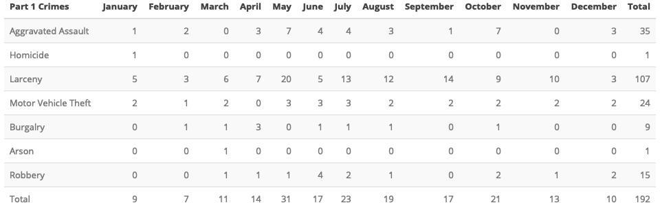
```

```{r echo = FALSE}
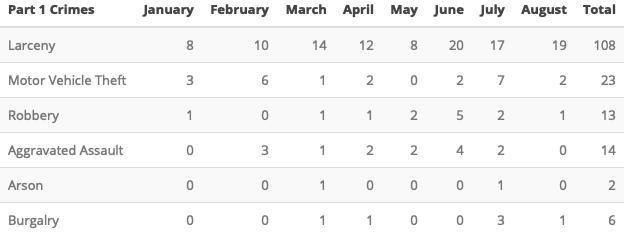
```

## Forest Park Southeast: August 2019 

```{r FPSE Tables, include = FALSE}
monthCrimes19 %>% 
  filter(., neighborhood == 39) %>% 
  group_by(crimeCatName) %>% 
  count() %>% 
  adorn_totals(., "row", name = "Total") %>%
  rename(., "Number of Crimes" = n, "Part 1 Crimes" = crimeCatName) -> fpse_crimeCat

monthCrimes19 %>% 
  filter(., neighborhood == 39) %>% 
  group_by(weekday) %>% 
  count() %>%
  adorn_totals(., "row", name = "Total") %>%
  rename(., "Number of Crimes" = n, "Day of the Week" = weekday) -> fpse_weekDay

monthCrimes19 %>% 
  filter(., neighborhood == 39) %>% 
  group_by(violent) %>% 
  count() %>%
  adorn_totals(., "row", name = "Total") %>%
  rename(., "Number of Crimes" = n, "Crimes Against Persons" = violent) -> fpse_violent

monthCrimes19 %>% 
  filter(., neighborhood == 39) %>% 
  group_by(dayNight) %>% 
  count() %>%
  adorn_totals(., "row", name = "Total") %>%
  rename(., "Number of Crimes" = n, "Time of Day" = dayNight) -> fpse_dayNight

```

```{r Save FPSE Kables, include = FALSE}
kable(fpse_crimeCat) %>%
  kable_styling(bootstrap_options = c("striped", "hover"), full_width = F, position = "center") %>% 
  save_kable("fpse_crimCat.jpeg")

kable(fpse_weekDay) %>%
  kable_styling(bootstrap_options = c("striped", "hover"), full_width = F, position = "center") %>% 
  save_kable("fpse_weekDay.jpeg")

kable(fpse_violent) %>%
  kable_styling(bootstrap_options = c("striped", "hover"), full_width = F, position = "center") %>% 
  save_kable("fpse_violent.jpeg")

kable(fpse_dayNight) %>%
  kable_styling(bootstrap_options = c("striped", "hover"), full_width = F, position = "center") %>% 
  save_kable("fpse_dayNight.jpeg")
```


```{r Knit FPSE Kable Crime Categories, echo = FALSE} 
knitr::include_graphics("fpse_crimCat.jpeg", dpi = 1000)
```

```{r Knit FPSE Kable Weekday, echo = FALSE} 
knitr::include_graphics("fpse_weekDay.jpeg", dpi = 1000)
```


```{r Knit FPSE Kable Violent Crimes, echo = FALSE}
knitr::include_graphics("fpse_violent.jpeg", dpi = 1000)
```

```{r Knit FPSE Kable Time of Day, echo = FALSE}
knitr::include_graphics("fpse_dayNight.jpeg", dpi = 1000)
```

## Forest Park Southeast Total Crime

```{r FPSE Total Crime, include = FALSE}
tm_shape(fpse_tiles) +
  tm_rgb() +
  nhoods_sf %>%
  filter(., neighborhood == 39) %>% 
  tm_shape() +
    tm_fill(col = "#9ecae1", 
            alpha = .5) +
    tm_borders(col = "black", 
               lwd = 2, 
               lty = "dashed") +
  filter(monthCrimes19_sf, 
         neighborhood == 39) %>%
  tm_shape() +
    tm_bubbles(size = .25, 
               col = "crimeCatName", 
               palette = "Set1", 
               title.col = "Part 1 Crimes") +
  tm_credits("© Mapbox, © OpenStreetMap", position = c("left", "BOTTOM")) +
  tm_layout(
    frame = FALSE,
    legend.bg.color = "white", 
    legend.frame=TRUE,
    legend.outside = TRUE,
    legend.position = c("right", "bottom")) -> fpse_total_tm

tmap_save(fpse_total_tm, file = here("results/fpse/2019/august/fpse_total_crimes.jpeg"), dpi = 500)
```

```{r FPSE Total Crimes Knit, echo = FALSE}
knitr::include_graphics(here("results/fpse/2019/august/fpse_total_crimes.jpeg"))
```

## Summary Notes: Botanical Heights 

```{r Botanical Heights Summary, include=FALSE}
tc18 <- nrow(monthCrimes18[monthCrimes18$neighborhood == 28,])
tc19 <- nrow(monthCrimes19[monthCrimes19$neighborhood == 28,])
cap18 <- nrow(monthCrimes18[monthCrimes18$neighborhood == 28 & monthCrimes18$crimeCatNum == 4 | monthCrimes18$neighborhood == 28 & monthCrimes18$crimeCatNum == 3,])
cap19 <- nrow(monthCrimes19[monthCrimes19$neighborhood == 28 & monthCrimes19$crimeCatNum == 4 | monthCrimes19$neighborhood == 28 & monthCrimes19$crimeCatNum == 3,])

tc_ytd18 <- nrow(ytdCrimes18[ytdCrimes18$neighborhood == 28,])
tc_ytdCurrent <- nrow(ytdCrimes19[ytdCrimes19$neighborhood == 28,])
cap18_ytd <- nrow(ytdCrimes18[ytdCrimes18$neighborhood == 28 & ytdCrimes18$crimeCatNum == 4 | ytdCrimes18$neighborhood == 28 & ytdCrimes18$crimeCatNum == 3,])
cap19_ytd <- nrow(ytdCrimes19[ytdCrimes19$neighborhood == 28 & ytdCrimes19$crimeCatNum == 4 | ytdCrimes19$neighborhood == 28 & ytdCrimes19$crimeCatNum == 3,])

pct_chg_mth <- (tc19 - tc18)/tc18
pct_chg_mth <- percent(pct_chg_mth)
pct_chg_cap <- (cap19 - cap18)/cap18 
pct_chg_cap <- percent(pct_chg_cap)
pct_chg_ytd <- (tc_ytdCurrent - tc_ytd18)/tc_ytd18
pct_chg_ytd <- percent(pct_chg_ytd)
pct_chg_ytd_cap <- (cap19_ytd - cap18_ytd)/cap18_ytd
pct_chg_ytd_cap <- percent(pct_chg_ytd_cap)
```

```{r, echo = FALSE}
sprintf("%s total crimes in August 2019", tc19)
sprintf("%s change compared to August 2018 (%s total crimes)", pct_chg_mth, tc18)
sprintf("%s crime(s) against persons in August 2019", cap19)
sprintf("%s change compared to August 2018 (%s crimes against persons)", pct_chg_cap, cap18)
sprintf("%s total crimes in 2019", tc_ytdCurrent)
sprintf("%s change compared to this time in 2018 (%s total crimes)", pct_chg_ytd, tc_ytd18)
sprintf("%s crime(s) against persons in 2019", cap19_ytd)
sprintf("%s change compared to this time in 2018 (%s crimes against persons)", pct_chg_ytd_cap, cap18_ytd)
```

## Comparing 2018 to 2019: Botanical Heights

```{r Botanical Heights Year Comps,include=FALSE}
totalCrimes18 %>% 
  filter(., neighborhood == 28) %>% 
  group_by(monthVar) %>% 
  count(crimeCatName) %>% 
  arrange(., crimeCatName) %>%
  rename(., "Number of Crimes" = n) %>% 
  pivot_wider(names_from = monthVar, values_from = "Number of Crimes") %>% 
  replace(., is.na(.), 0) %>% 
  rename(., "Part 1 Crimes" = crimeCatName, 
         "January" = "01",
         "February" = "02",
         "March" = "03",
         "April" = "04",
         "May" = "05",
         "June" = "06",
         "July" = "07",
         "August" = "08",
         "September" = "09",
         "October" = "10",
         "November" = "11",
         "December" = "12") %>% 
  adorn_totals(., "col", name = "Total") %>% 
  adorn_totals(., "row", name = "Total") -> bot_2018

ytdCrimes19 %>% 
  filter(., neighborhood == 28) %>% 
  group_by(monthVar) %>% 
  count(crimeCatName) %>% 
  arrange(., crimeCatName) %>%
  rename(., "Number of Crimes" = n) %>% 
  pivot_wider(names_from = monthVar, values_from = "Number of Crimes") %>% 
  replace(., is.na(.), 0) %>% 
  rename(., "Part 1 Crimes" = crimeCatName, 
         "January" = "01",
         "February" = "02",
         "March" = "03",
         "April" = "04",
         "May" = "05",
         "June" = "06",
         "July" = "07",
         "August" = "08") %>%
  adorn_totals(., "col", name = "Total") %>% 
  adorn_totals(., "row", name = "Total") -> bot_2019 
```

```{r Botanical Heights Tables, echo = FALSE}
kable(bot_2018) %>%
  kable_styling(bootstrap_options = c("striped", "hover", "scale_down"), 
                full_width = F, position = "center") %>% 
  save_kable("bot_2018.jpeg")

kable(bot_2019) %>%
  kable_styling(bootstrap_options = c("striped", "hover", "scale_down"), 
                full_width = F, position = "center") %>% 
  save_kable("bot_2019.jpeg")
```

```{r echo = FALSE}
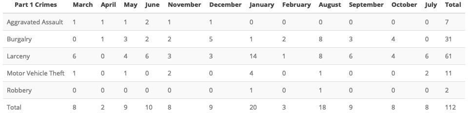
```

```{r echo = FALSE}
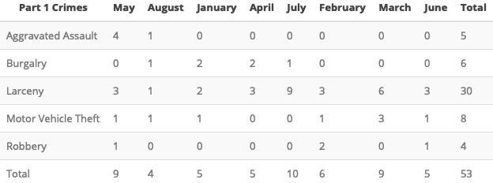
```

```{r, include = FALSE}
monthCrimes19 %>% 
  filter(., neighborhood == 28) %>% 
  group_by(crimeCatName) %>% 
  count() %>% 
  adorn_totals(., "row", name = "Total") %>%
  rename(., "Number of Crimes" = n, "Part 1 Crimes" = crimeCatName) -> bot_crimeCat

monthCrimes19 %>% 
  filter(., neighborhood == 28) %>% 
  group_by(weekday) %>% 
  count() %>%
  adorn_totals(., "row", name = "Total") %>%
  rename(., "Number of Crimes" = n, "Day of the Week" = weekday) -> bot_weekDay

monthCrimes19 %>% 
  filter(., neighborhood == 28) %>% 
  group_by(violent) %>% 
  count() %>%
  adorn_totals(., "row", name = "Total") %>%
  rename(., "Number of Crimes" = n, "Crimes Against Persons" = violent) -> bot_violent


monthCrimes19 %>% 
  filter(., neighborhood == 28) %>% 
  group_by(dayNight) %>% 
  count() %>%
  adorn_totals(., "row", name = "Total") %>%
  rename(., "Number of Crimes" = n, "Time of Day" = dayNight) -> bot_dayNight
```

```{r include = FALSE}
kable(bot_crimeCat) %>%
  kable_styling(bootstrap_options = c("striped", "hover"), full_width = F, position = "center") %>% 
  save_kable("bot_crimCat.jpeg")

kable(bot_weekDay) %>%
  kable_styling(bootstrap_options = c("striped", "hover"), full_width = F, position = "center") %>% 
  save_kable("bot_weekDay.jpeg")

kable(bot_violent) %>%
  kable_styling(bootstrap_options = c("striped", "hover"), full_width = F, position = "center") %>% 
  save_kable("bot_violent.jpeg")

kable(bot_dayNight) %>%
  kable_styling(bootstrap_options = c("striped", "hover"), full_width = F, position = "center") %>% 
  save_kable("bot_dayNight.jpeg")
```

```{r Knit BOT Kable Crime Categories, echo = FALSE} 
knitr::include_graphics("bot_crimCat.jpeg", dpi = 1000)
```

```{r Knit BOT Kable Weekday, echo = FALSE} 
knitr::include_graphics("bot_weekDay.jpeg", dpi = 1000)
```


```{r Knit BOT Kable Violent Crimes, echo = FALSE}
knitr::include_graphics("bot_violent.jpeg", dpi = 1000)
```

```{r Knit BOT Kable Time of Day, echo = FALSE}
knitr::include_graphics("bot_dayNight.jpeg", dpi = 1000)
```

## Botanical Heights Total Crime

```{r Botanical Heights Total Crime, include = FALSE}
bot_total_tm <- tm_shape(bot_tiles) +
  tm_rgb() +
  nhoods_sf %>%
  filter(., neighborhood == 28) %>% 
  tm_shape() +
    tm_fill(col = "#9ecae1", 
            alpha = .5) +
    tm_borders(col = "black", 
               lwd = 2, 
               lty = "dashed") +
  filter(monthCrimes19_sf, 
         neighborhood == 28) %>%
  tm_shape() +
    tm_bubbles(size = .25, 
               col = "crimeCatName", 
               palette = "Set1", 
               title.col = "Part 1 Crimes") +
  tm_credits("© Mapbox, © OpenStreetMap", position = c("left", "BOTTOM")) +
  tm_layout(
    frame = FALSE,
    legend.bg.color = "white", 
    legend.frame=TRUE,
    legend.outside = TRUE,
    legend.position = c("right", "bottom")) 

tmap_save(bot_total_tm, file = here("results/bot/2019/bot_total_crimes.jpeg"), dpi = 500)
```

```{r BOT Total Crimes Knit, echo = FALSE}
knitr::include_graphics(here("results/bot/2019/bot_total_crimes.jpeg"))
```

## Botanical Heights Crime by Days of the Week

```{r BOT Crime by Weekday - Graph, include = FALSE}
monthCrimes19 %>% 
  filter(., neighborhood == 28) %>% 
  group_by(weekday) %>% 
  count() %>%
  ggplot(., aes(x=weekday, y=n, group=1)) +
    geom_line(color="blue") +
    geom_point() + 
    xlab("Day of Week") + ylab("Total Crimes")

ggsave(here("results/graphs/bot_crime_weekday.jpeg"), dpi = 300)
```

```{r BOT Crimes Knit Weekday, echo = FALSE}
knitr::include_graphics(here("results/graphs/bot_crime_weekday.jpeg"))
```

## District 2 Crime Rates 

```{r Generate District 2 Density Maps, include = FALSE}
dst2_rateMap <- tm_shape(dst2_tiles) +
  tm_rgb() +
  tm_shape(dst_2_pop_sf) +
  tm_polygons(col = "crimeRate",
              palette = "BuPu",
              style = "jenks",
              title = "Crimes per 1,000 Residents") +
  tm_text("neighborhood", shadow=TRUE) +
  tm_layout(
    frame = FALSE,
    legend.bg.color = "white", 
    legend.frame=TRUE,
    legend.outside = TRUE,
    legend.position = c("right", "bottom")) 

tmap_save(dst2_rateMap, file = here("results/district-2/2019/dst2_aug_rates.jpeg"), dpi = 500)
```

```{r Dst 2 Rate of Crimes Knit, echo = FALSE}
knitr::include_graphics(here("results/district-2/2019/dst2_aug_rates.jpeg"))
```

```{r include = FALSE}
library(qwraps2)
options(qwraps2_markup = "markdown")

dst_2_pop_sf <- as.data.frame(dst_2_pop_sf)
summary_statistics <-
  list(
    "Crime Rates" =
      list(
        "mean" = ~mean(crimeRate, na_rm = TRUE),
        "min" = ~min(crimeRate, na.rm = TRUE),
        "max" = ~max(crimeRate, na.rm = TRUE)),
    "Crime Total" =
      list(
        "mean" = ~mean(crimeTotal, na_rm = TRUE),
        "min" = ~min(crimeTotal, na.rm = TRUE),
        "max" = ~max(crimeTotal, na.rm = TRUE)))
 
dst_2_table <- summary_table(dst_2_pop_sf, summary_statistics)

print(dst_2_table, 
      cnames = "Summary Statistics")
```

```{r include = FALSE}
dst_2_rate_mean <- mean(dst_2_pop_sf$crimeRate)
dst_2_rate_mean

dst_2_min <- dst_2_pop_sf[which.min(dst_2_pop_sf$crimeRate),]
dst_2_min_rate_nhd <- print(dst_2_min$NHD_NAME, max.levels = 0)
dst_2_min_rate <- print(dst_2_min$crimeRate, max.levels = 0)

dst_2_max <- dst_2_pop_sf[which.max(dst_2_pop_sf$crimeRate),]
dst_2_max_rate_nhd <- print(dst_2_max$NHD_NAME, max.levels = 0)
dst_2_max_rate <- print(dst_2_max$crimeRate, max.levels = 0)

dst_2_total_mean <- mean(dst_2_pop_sf$crimeTotal)
dst_2_total_mean

dst_2_minT <- dst_2_pop_sf[which.min(dst_2_pop_sf$crimeTotal),]
dst_2_min_tot_nhd <- print(dst_2_minT$NHD_NAME, max.levels = 0)
dst_2_min_tot <- print(dst_2_minT$crimeTotal, max.levels = 0)

dst_2_maxT <- dst_2_pop_sf[which.max(dst_2_pop_sf$crimeTotal),]
dst_2_max_tot_nhd <- print(dst_2_maxT$NHD_NAME, max.levels = 0)
dst_2_max_tot <- print(dst_2_maxT$crimeTotal, max.levels = 0)

```

## District 2 Density Map Explanation 

There are 23 neighborhoods in District 2. The South Hampton neighborhood is split between District 2 and District 1. 

```{r, echo = FALSE}
sprintf("The minimum number of crimes in one neighborhood was %s (%s)", dst_2_min_tot, dst_2_min_tot_nhd)
sprintf("The maximum number of crimes in one neighborhood was %s (%s)", dst_2_max_tot, dst_2_max_tot_nhd)
sprintf("The mean number of crimes in one neighborhood was %s", round(dst_2_total_mean, digits = 2))

sprintf("The minimum rate of crimes in one neighborhood was %s (%s)", round(dst_2_min_rate, digits = 2), dst_2_min_rate_nhd)
sprintf("The maximum rate of crimes in one neighborhood was %s (%s)", round(dst_2_max_rate, digits = 2), dst_2_max_rate_nhd)
sprintf("The mean rate of crimes in one neighborhood was %s", round(dst_2_rate_mean, digits = 2))
```

## Summary Notes: Central West End

```{r Central West End Summary, include=FALSE}
tc18 <- nrow(monthCrimes18[monthCrimes18$neighborhood == 38,])
tc19 <- nrow(monthCrimes19[monthCrimes19$neighborhood == 38,])
cap18 <- nrow(monthCrimes18[monthCrimes18$neighborhood == 38 & monthCrimes18$crimeCatNum == 4 | monthCrimes18$neighborhood == 38 & monthCrimes18$crimeCatNum == 3,])
cap19 <- nrow(monthCrimes19[monthCrimes19$neighborhood == 38 & monthCrimes19$crimeCatNum == 4 | monthCrimes19$neighborhood == 38 & monthCrimes19$crimeCatNum == 3,])

tc_ytd18 <- nrow(ytdCrimes18[ytdCrimes18$neighborhood == 38,])
tc_ytdCurrent <- nrow(ytdCrimes19[ytdCrimes19$neighborhood == 38,])
cap18_ytd <- nrow(ytdCrimes18[ytdCrimes18$neighborhood == 38 & ytdCrimes18$crimeCatNum == 4 | ytdCrimes18$neighborhood == 38 & ytdCrimes18$crimeCatNum == 3,])
cap19_ytd <- nrow(ytdCrimes19[ytdCrimes19$neighborhood == 38 & ytdCrimes19$crimeCatNum == 4 | ytdCrimes19$neighborhood == 38 & ytdCrimes19$crimeCatNum == 3,])

pct_chg_mth <- (tc19 - tc18)/tc18
pct_chg_mth <- percent(pct_chg_mth)
pct_chg_cap <- (cap19 - cap18)/cap18 
pct_chg_cap <- percent(pct_chg_cap)
pct_chg_ytd <- (tc_ytdCurrent - tc_ytd18)/tc_ytd18
pct_chg_ytd <- percent(pct_chg_ytd)
pct_chg_ytd_cap <- (cap19_ytd - cap18_ytd)/cap18_ytd
pct_chg_ytd_cap <- percent(pct_chg_ytd_cap)
```

```{r, echo = FALSE}
sprintf("%s total crimes in August 2019", tc19)
sprintf("%s change compared to August 2018 (%s total crimes)", pct_chg_mth, tc18)
sprintf("%s crime(s) against persons in August 2019", cap19)
sprintf("%s change compared to August 2018 (%s crimes against persons)", pct_chg_cap, cap18)
sprintf("%s total crimes in 2019", tc_ytdCurrent)
sprintf("%s change compared to this time in 2018 (%s total crimes)", pct_chg_ytd, tc_ytd18)
sprintf("%s crime(s) against persons in 2019", cap19_ytd)
sprintf("%s change compared to this time in 2018 (%s crimes against persons)", pct_chg_ytd_cap, cap18_ytd)
```

## Comparing 2018 to 2019: Central West End

```{r Central West End,include=FALSE}
totalCrimes18 %>% 
  filter(., neighborhood == 38) %>% 
  group_by(monthVar) %>% 
  count(crimeCatName) %>% 
  arrange(., crimeCatName) %>%
  rename(., "Number of Crimes" = n) %>% 
  pivot_wider(names_from = monthVar, values_from = "Number of Crimes") %>% 
  replace(., is.na(.), 0) %>% 
  rename(., "Part 1 Crimes" = crimeCatName, 
         "January" = "01",
         "February" = "02",
         "March" = "03",
         "April" = "04",
         "May" = "05",
         "June" = "06",
         "July" = "07",
         "August" = "08",
         "September" = "09",
         "October" = "10",
         "November" = "11",
         "December" = "12") %>% 
  adorn_totals(., "col", name = "Total") %>% 
  adorn_totals(., "row", name = "Total") -> cwe_2018

ytdCrimes19 %>% 
  filter(., neighborhood == 38) %>% 
  group_by(monthVar) %>% 
  count(crimeCatName) %>% 
  arrange(., crimeCatName) %>%
  rename(., "Number of Crimes" = n) %>% 
  pivot_wider(names_from = monthVar, values_from = "Number of Crimes") %>% 
  replace(., is.na(.), 0) %>% 
  rename(., "Part 1 Crimes" = crimeCatName, 
         "January" = "01",
         "February" = "02",
         "March" = "03",
         "April" = "04",
         "May" = "05",
         "June" = "06",
         "July" = "07",
         "August" = "08") %>%
  adorn_totals(., "col", name = "Total") %>% 
  adorn_totals(., "row", name = "Total") -> cwe_2019 
```

```{r, echo = FALSE}
kable(cwe_2018) %>%
  kable_styling(bootstrap_options = c("striped", "hover", "scale_down"), 
                full_width = F, position = "center") %>% 
  save_kable("cwe_2018.jpeg")

kable(cwe_2019) %>%
  kable_styling(bootstrap_options = c("striped", "hover", "scale_down"), 
                full_width = F, position = "center") %>% 
  save_kable("cwe_2019.jpeg")
```

```{r echo = FALSE}
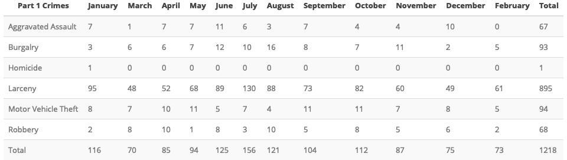
```

```{r echo = FALSE}
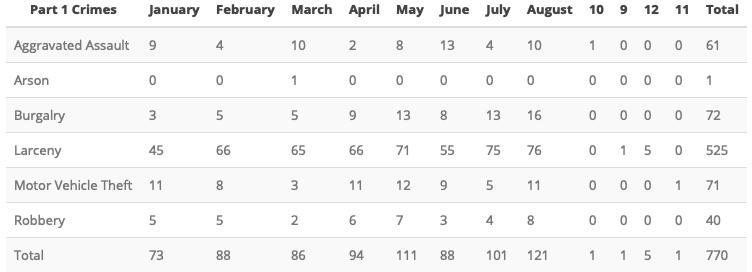
```

## Central West End: August 2019 

```{r cwe Tables, include = FALSE}
monthCrimes19 %>% 
  filter(., neighborhood == 38) %>% 
  group_by(crimeCatName) %>% 
  count() %>% 
  adorn_totals(., "row", name = "Total") %>%
  rename(., "Number of Crimes" = n, "Part 1 Crimes" = crimeCatName) -> cwe_crimeCat

monthCrimes19 %>% 
  filter(., neighborhood == 38) %>% 
  group_by(weekday) %>% 
  count() %>%
  adorn_totals(., "row", name = "Total") %>%
  rename(., "Number of Crimes" = n, "Day of the Week" = weekday) -> cwe_weekDay

monthCrimes19 %>% 
  filter(., neighborhood == 38) %>% 
  group_by(violent) %>% 
  count() %>%
  adorn_totals(., "row", name = "Total") %>%
  rename(., "Number of Crimes" = n, "Crimes Against Persons" = violent) -> cwe_violent

monthCrimes19 %>% 
  filter(., neighborhood == 38) %>% 
  group_by(dayNight) %>% 
  count() %>%
  adorn_totals(., "row", name = "Total") %>%
  rename(., "Number of Crimes" = n, "Time of Day" = dayNight) -> cwe_dayNight

```

```{r Save cwe Kables, include = FALSE}
kable(cwe_crimeCat) %>%
  kable_styling(bootstrap_options = c("striped", "hover"), full_width = F, position = "center") %>% 
  save_kable("cwe_crimCat.jpeg")

kable(cwe_weekDay) %>%
  kable_styling(bootstrap_options = c("striped", "hover"), full_width = F, position = "center") %>% 
  save_kable("cwe_weekDay.jpeg")

kable(cwe_violent) %>%
  kable_styling(bootstrap_options = c("striped", "hover"), full_width = F, position = "center") %>% 
  save_kable("cwe_violent.jpeg")

kable(cwe_dayNight) %>%
  kable_styling(bootstrap_options = c("striped", "hover"), full_width = F, position = "center") %>% 
  save_kable("cwe_dayNight.jpeg")
```


```{r Knit cwe Kable Crime Categories, echo = FALSE} 
knitr::include_graphics("cwe_crimCat.jpeg", dpi = 1000)
```

```{r Knit cwe Kable Weekday, echo = FALSE} 
knitr::include_graphics("cwe_weekDay.jpeg", dpi = 1000)
```


```{r Knit cwe Kable Violent Crimes, echo = FALSE}
knitr::include_graphics("cwe_violent.jpeg", dpi = 1000)
```

```{r Knit cwe Kable Time of Day, echo = FALSE}
knitr::include_graphics("cwe_dayNight.jpeg", dpi = 1000)
```

## Central West End Total Crime

```{r cwe Total Crime, include = FALSE}
tm_shape(cwe_tiles) +
  tm_rgb() +
  nhoods_sf %>%
  filter(., neighborhood == 38) %>% 
  tm_shape() +
    tm_fill(col = "#9ecae1", 
            alpha = .5) +
    tm_borders(col = "black", 
               lwd = 2, 
               lty = "dashed") +
  filter(monthCrimes19_sf, 
         neighborhood == 38) %>%
  tm_shape() +
    tm_bubbles(size = .25, 
               col = "crimeCatName", 
               palette = "Set1", 
               title.col = "Part 1 Crimes") +
  tm_credits("© Mapbox, © OpenStreetMap", position = c("left", "BOTTOM")) +
  tm_layout(
    frame = FALSE,
    legend.bg.color = "white", 
    legend.frame=TRUE,
    legend.outside = TRUE,
    legend.position = c("right", "bottom")) -> cwe_total_tm

tmap_save(cwe_total_tm, file = here("results/cwe/2019/august/cwe_total_crimes.jpeg"), dpi = 500)
```

```{r cwe Total Crimes Knit, echo = FALSE}
knitr::include_graphics(here("results/cwe/2019/august/cwe_total_crimes.jpeg"))
```

## Washington University Medical Campus: August 2019

```{r Med Campus Summary, include=FALSE}
tc18 <- nrow(mc_crimes_month18)
tc19 <- nrow(mc_crimes_month19)
cap18 <- nrow(mc_crimes_month18[mc_crimes_month18$crimeCatNum == 4 | mc_crimes_month18$crimeCatNum == 3,])
cap19 <- nrow(mc_crimes_month19[mc_crimes_month19$crimeCatNum == 4 | mc_crimes_month19$crimeCatNum == 3,])

tc_ytd18 <- nrow(mc_crimes_ytd18)
tc_ytdCurrent <- nrow(mc_crimes_ytd19)
cap18_ytd <- nrow(mc_crimes_ytd18[mc_crimes_ytd18$crimeCatNum == 4 | mc_crimes_ytd18$crimeCatNum == 3,])
cap19_ytd <- nrow(mc_crimes_ytd19[mc_crimes_ytd19$crimeCatNum == 4 | mc_crimes_ytd19$crimeCatNum == 3,])

pct_chg_mth <- (tc19 - tc18)/tc18
pct_chg_mth <- percent(pct_chg_mth)
pct_chg_cap <- (cap19 - cap18)/cap18 
pct_chg_cap <- percent(pct_chg_cap)
pct_chg_ytd <- (tc_ytdCurrent - tc_ytd18)/tc_ytd18
pct_chg_ytd <- percent(pct_chg_ytd)
pct_chg_ytd_cap <- (cap19_ytd - cap18_ytd)/cap18_ytd
pct_chg_ytd_cap <- percent(pct_chg_ytd_cap)
```

```{r, echo = FALSE}
sprintf("%s total crimes in August 2019", tc19)
sprintf("%s change compared to August 2018 (%s total crimes)", pct_chg_mth, tc18)
sprintf("%s crime(s) against persons in August 2019", cap19)
sprintf("%s change compared to August 2018 (%s crimes against persons)", pct_chg_cap, cap18)
sprintf("%s total crimes in 2019", tc_ytdCurrent)
sprintf("%s change compared to this time in 2018 (%s total crimes)", pct_chg_ytd, tc_ytd18)
sprintf("%s crime(s) against persons in 2019", cap19_ytd)
sprintf("%s change compared to this time in 2018 (%s crimes against persons)", pct_chg_ytd_cap, cap18_ytd)
```

## WUMC Campus: Comparing 2018 and 2019

```{r, include = FALSE}
mc_crimes_total18 %>% 
  group_by(monthVar) %>% 
  count(crimeCatName) %>% 
  arrange(., crimeCatName) %>%
  rename(., "Number of Crimes" = n) %>% 
  pivot_wider(names_from = monthVar, values_from = "Number of Crimes") %>% 
  replace(., is.na(.), 0) %>% 
  rename(., "Part 1 Crimes" = crimeCatName, 
         "January" = "01",
         "February" = "02",
         "March" = "03",
         "April" = "04",
         "May" = "05",
         "June" = "06",
         "July" = "07",
         "August" = "08",
         "September" = "09",
         "October" = "10",
         "November" = "11",
         "December" = "12") %>% 
  adorn_totals(., "col", name = "Total") %>% 
  adorn_totals(., "row", name = "Total") -> mc_2018

mc_crimes_ytd19 %>% 
  group_by(monthVar) %>% 
  count(crimeCatName) %>% 
  arrange(., crimeCatName) %>%
  rename(., "Number of Crimes" = n) %>% 
  pivot_wider(names_from = monthVar, values_from = "Number of Crimes") %>% 
  replace(., is.na(.), 0) %>% 
  rename(., "Part 1 Crimes" = crimeCatName, 
         "January" = "01",
         "February" = "02",
         "March" = "03",
         "April" = "04",
         "May" = "05",
         "June" = "06",
         "July" = "07",
         "August" = "08") %>%
  adorn_totals(., "col", name = "Total") %>% 
  adorn_totals(., "row", name = "Total") -> mc_2019 
```

```{r, include = FALSE}
kable(mc_2018) %>%
  kable_styling(bootstrap_options = c("striped", "hover", "scale_down"), 
                full_width = F, position = "center") %>% 
  save_kable("mc_2018.jpeg")

kable(mc_2019) %>%
  kable_styling(bootstrap_options = c("striped", "hover", "scale_down"), 
                full_width = F, position = "center") %>% 
  save_kable("mc_2019.jpeg")
```

```{r echo = FALSE}
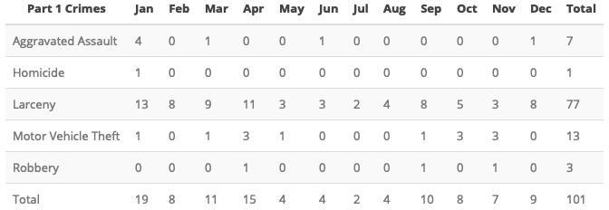
```

```{r echo = FALSE}
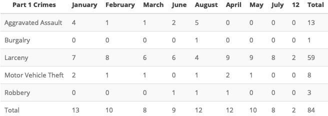
```

## WUMC Campus: August 2019

```{r, include = FALSE}
mc_crimes_month19 %>% 
  group_by(crimeCatName) %>% 
  count() %>% 
  adorn_totals(., "row", name = "Total") %>%
  rename(., "Number of Crimes" = n, "Part 1 Crimes" = crimeCatName) -> mc_crimeCat

kable(mc_crimeCat) %>%
  kable_styling(bootstrap_options = c("striped", "hover"), full_width = F, position = "center") %>% 
  save_kable("mc_crimCat.jpeg")

mc_crimes_month19 %>% 
  group_by(dayNight) %>% 
  count() %>%
  adorn_totals(., "row", name = "Total") %>%
  rename(., "Number of Crimes" = n, "Time of Day" = dayNight) -> mc_dayNight

kable(mc_dayNight) %>%
  kable_styling(bootstrap_options = c("striped", "hover"), full_width = F, position = "center") %>% 
  save_kable("mc_dayNight.jpeg")

mc_larcenies %>% 
  group_by(type) %>% 
  count() %>%
  adorn_totals(., "row", name = "Total") %>%
  rename(., "Number of Crimes" = n, "Type of Larceny" = type) -> mc_larcenies_cat

kable(mc_larcenies_cat) %>%
  kable_styling(bootstrap_options = c("striped", "hover"), full_width = F, position = "center") %>% 
  save_kable("mc_larcenies_cat.jpeg")

mc_larcenies %>% 
  group_by(value) %>% 
  count() %>%
  adorn_totals(., "row", name = "Total") %>%
  rename(., "Number of Crimes" = n, "Monetary Value" = value) -> mc_larcenies_val

kable(mc_larcenies_val) %>%
  kable_styling(bootstrap_options = c("striped", "hover"), full_width = F, position = "center") %>% 
  save_kable("mc_larcenies_val.jpeg")
```

```{r echo = FALSE}
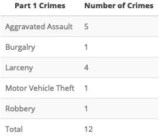
```

```{r echo = FALSE}
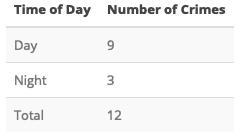
```

```{r echo = FALSE}
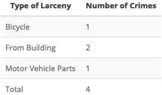
```

```{r echo = FALSE}
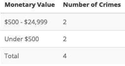
```

## Med. Campus Total Crime: August 2019

```{r include = FALSE}
cwe_mc_tm <- tm_shape(mc_tiles) +
  tm_rgb() +
  nhoods_sf %>%
  filter(., neighborhood == 38) %>% 
  tm_shape() +
    tm_borders(col = "black", 
               lwd = 2, 
               lty = "dashed") +
  tm_shape(med_campus) +
    tm_fill(col = "#9ecae1", 
            alpha = .5) +
    tm_borders(col = "black", 
               lwd = 1, 
               lty = "solid") +
  tm_shape(mc_crimes_month19_sf) +
    tm_bubbles(size = .25, 
               col = "crimeCatName", 
               palette = "Set1", 
               title.col = "Part 1 Crimes") +
  tm_credits("© Mapbox, © OpenStreetMap", position = c("left", "BOTTOM")) +
  tm_layout(
    frame = FALSE,
    legend.bg.color = "white", 
    legend.frame=TRUE,
    legend.outside = TRUE,
    legend.position = c("right", "bottom"))

tmap_save(cwe_mc_tm, file = here("results/cwe/2019/august/mc_total_crimes.jpeg"), dpi = 500)
```

```{r MC Total Crimes Knit, echo = FALSE}
knitr::include_graphics(here("results/cwe/2019/august/mc_total_crimes.jpeg"))
```

## Cortex Total Crimes 

```{r Cortext Total Crimes, include = FALSE}
cwe_ctx_tm <- tm_shape(ctx_tiles) +
  tm_rgb() +
  nhoods_sf %>%
  filter(., neighborhood == 38) %>% 
  tm_shape() +
    tm_borders(col = "black", 
               lwd = 2, 
               lty = "dashed") +
  tm_shape(cortex) +
    tm_fill(col = "#9ecae1", 
            alpha = .5) +
    tm_borders(col = "black", 
               lwd = 1, 
               lty = "solid") +
  tm_shape(ctx_crimes_sf) +
    tm_bubbles(size = .25, 
               col = "crimeCatName", 
               palette = "Set1", 
               title.col = "Part 1 Crimes") +
  tm_credits("© Mapbox, © OpenStreetMap", position = c("left", "BOTTOM")) +
  tm_layout(
    frame = FALSE,
    legend.bg.color = "white", 
    legend.frame=TRUE,
    legend.outside = TRUE,
    legend.position = c("right", "bottom")) 

tmap_save(cwe_ctx_tm, file = here("results/cwe/2019/august/cwe_ctx_crimes.jpeg"), dpi = 500)
```

```{r Cortex Total Crimes Knit, echo = FALSE}
knitr::include_graphics(here("results/cwe/2019/august/cwe_ctx_crimes.jpeg"))
```

## District 5 Crime Rates 

```{r Generate District 5 Density Maps, include = FALSE}
dst5_rateMap <- tm_shape(dst5_tiles) +
  tm_rgb() +
  tm_shape(dst_5_pop_sf) +
  tm_polygons(col = "crimeRate",
              palette = "BuPu",
              style = "jenks",
              title = "Crimes per 1,000 Residents") +
  tm_text("neighborhood", shadow=TRUE) +
  tm_layout(
    frame = FALSE,
    legend.bg.color = "white", 
    legend.frame=TRUE,
    legend.outside = TRUE,
    legend.position = c("right", "bottom")) 

tmap_save(dst5_rateMap, file = here("results/district-5/2019/dst5_aug_rates.jpeg"), dpi = 500)
```

```{r Dst 5 Rate of Crimes Knit, echo = FALSE}
knitr::include_graphics(here("results/district-5/2019/dst5_aug_rates.jpeg"))
```

```{r include = FALSE}
library(qwraps2)
options(qwraps2_markup = "markdown")

dst_5_pop_sf <- as.data.frame(dst_5_pop_sf)
summary_statistics <-
  list(
    "Crime Rates" =
      list(
        "mean" = ~mean(crimeRate, na_rm = TRUE),
        "min" = ~min(crimeRate, na.rm = TRUE),
        "max" = ~max(crimeRate, na.rm = TRUE)),
    "Crime Total" =
      list(
        "mean" = ~mean(crimeTotal, na_rm = TRUE),
        "min" = ~min(crimeTotal, na.rm = TRUE),
        "max" = ~max(crimeTotal, na.rm = TRUE)))
 
dst_5_table <- summary_table(dst_5_pop_sf, summary_statistics)

print(dst_5_table, 
      cnames = "Summary Statistics")
```

```{r include = FALSE}
dst_5_rate_mean <- mean(dst_5_pop_sf$crimeRate)
dst_5_rate_mean

dst_5_min <- dst_5_pop_sf[which.min(dst_5_pop_sf$crimeRate),]
dst_5_min_rate_nhd <- print(dst_5_min$NHD_NAME, max.levels = 0)
dst_5_min_rate <- print(dst_5_min$crimeRate, max.levels = 0)

dst_5_max <- dst_5_pop_sf[which.max(dst_5_pop_sf$crimeRate),]
dst_5_max_rate_nhd <- print(dst_5_max$NHD_NAME, max.levels = 0)
dst_5_max_rate <- print(dst_5_max$crimeRate, max.levels = 0)

dst_5_total_mean <- mean(dst_5_pop_sf$crimeTotal)
dst_5_total_mean

dst_5_minT <- dst_5_pop_sf[which.min(dst_5_pop_sf$crimeTotal),]
dst_5_min_tot_nhd <- print(dst_5_minT$NHD_NAME, max.levels = 0)
dst_5_min_tot <- print(dst_5_minT$crimeTotal, max.levels = 0)

dst_5_maxT <- dst_5_pop_sf[which.max(dst_5_pop_sf$crimeTotal),]
dst_5_max_tot_nhd <- print(dst_5_maxT$NHD_NAME, max.levels = 0)
dst_5_max_tot <- print(dst_5_maxT$crimeTotal, max.levels = 0)

```

## District 5 Density Map Explanation 

There are 15 neighborhoods in District 5.

```{r, echo = FALSE}
sprintf("The minimum number of crimes in one neighborhood was %s (%s)", dst_5_min_tot, dst_5_min_tot_nhd)
sprintf("The maximum number of crimes in one neighborhood was %s (%s)", dst_5_max_tot, dst_5_max_tot_nhd)
sprintf("The mean number of crimes in one neighborhood was %s", round(dst_5_total_mean, digits = 2))

sprintf("The minimum rate of crimes in one neighborhood was %s (%s)", round(dst_5_min_rate, digits = 2), dst_5_min_rate_nhd)
sprintf("The maximum rate of crimes in one neighborhood was %s (%s)", round(dst_5_max_rate, digits = 2), dst_5_max_rate_nhd)
sprintf("The mean rate of crimes in one neighborhood was %s", round(dst_5_rate_mean, digits = 2))
```

## Forest Park Southeast Neighborhood Detail 
### Appendix 1 

## FPSE Time of Crimes 

```{r FPSE Day & Night, include = FALSE}
fpse_dn_tm <- tm_shape(fpse_tiles) +
  tm_rgb() +
  nhoods_sf %>%
  filter(., neighborhood == 39) %>% 
  tm_shape() +
    tm_fill(col = "#9ecae1", 
            alpha = .5) +
    tm_borders(col = "black", 
               lwd = 2, 
               lty = "dashed") +
  filter(monthCrimes19_sf, 
         neighborhood == 39) %>%
  tm_shape() +
    tm_bubbles(size = .25, 
               col = "dayNight", 
               palette = "-RdBu", 
               title.col = "Time of Crimes") +
  tm_credits("© Mapbox, © OpenStreetMap", position = c("left", "BOTTOM")) +
  tm_layout(
    frame = FALSE,
    legend.bg.color = "white", 
    legend.frame=TRUE,
    legend.outside = TRUE,
    legend.position = c("right", "bottom")) 

tmap_save(fpse_dn_tm, file = here("results/fpse/2019/august/fpse_day_night.jpeg"), dpi = 500)
```

```{r FPSE Day & Night Knit, echo = FALSE}
knitr::include_graphics(here("results/fpse/2019/august/fpse_day_night.jpeg"))
```

## FPSE Violent Crime

```{r FPSE Crimes Against Persons, include = FALSE}
fpse_vlnt_tm <- tm_shape(fpse_tiles) +
  tm_rgb() +
  nhoods_sf %>%
  filter(., neighborhood == 39) %>% 
  tm_shape() +
    tm_fill(col = "#9ecae1", 
            alpha = .5) +
    tm_borders(col = "black", 
               lwd = 2, 
               lty = "dashed") +
  filter(monthCrimes19_sf, 
         neighborhood == 39) %>%
  tm_shape() +
    tm_bubbles(size = .25, 
               col = "violent", 
               palette = "Reds", 
               title.col = "Violent") +
  tm_credits("© Mapbox, © OpenStreetMap", position = c("left", "BOTTOM")) +
  tm_layout(
    frame = FALSE,
    legend.bg.color = "white", 
    legend.frame=TRUE,
    legend.outside = TRUE,
    legend.position = c("right", "bottom")) 

tmap_save(fpse_vlnt_tm, file = here("results/fpse/2019/august/fpse_vlnt.jpeg"), dpi = 500)
```

```{r FPSE Violent Knit, echo = FALSE}
knitr::include_graphics(here("results/fpse/2019/august/fpse_vlnt.jpeg"))
```

## Grove Community Improvement District 

```{r Grove CID Total Crime, include = FALSE}
grove_crimes <- st_intersection(monthCrimes19_sf, grove_cid)

fpse_grove_tm <- tm_shape(grv_tiles) +
  tm_rgb() +
  nhoods_sf %>%
  filter(., neighborhood == 39) %>% 
  tm_shape() +
    tm_borders(col = "black", 
               lwd = 2, 
               lty = "dashed") +
  tm_shape(grove_cid) +
    tm_fill(col = "#9ecae1", 
            alpha = .5) +
    tm_borders(col = "black", 
               lwd = 1, 
               lty = "solid") +
  tm_shape(grove_crimes) +
    tm_bubbles(size = .25, 
               col = "crimeCatName", 
               palette = "Set1", 
               title.col = "Part 1 Crimes") +
  tm_credits("© Mapbox, © OpenStreetMap", position = c("left", "BOTTOM")) +
  tm_layout(
    frame = FALSE,
    legend.bg.color = "white", 
    legend.frame=TRUE,
    legend.outside = TRUE,
    legend.position = c("right", "bottom")) 

tmap_save(fpse_grove_tm, file = here("results/fpse/2019/august/fpse_grove.jpeg"), dpi = 500)
```

```{r FPSE Grove Knit, echo = FALSE}
knitr::include_graphics(here("results/fpse/2019/august/fpse_grove.jpeg"))
```

## FPSE Crime Density 

```{r FPSE Density Map SF, include = FALSE}
monthCrimes19_sf %>%
  filter(neighborhood == 39) %>%
  smooth_map(., bandwidth = 0.5, style = "pretty",
  cover = fpse) -> fpse_densities
```

```{r FPSE Density Map Output, include = FALSE}
fpse_den_tm <- tm_shape(fpse_tiles) +
  tm_rgb() +
  nhoods_sf %>%
  filter(., neighborhood == 39) %>% 
  tm_shape() +
    tm_fill(col = NA, 
            alpha = .5) +
    tm_borders(col = "black", 
               lwd = 2, 
               lty = "dashed") +
  tm_shape(fpse_densities$polygons) +
  tm_fill(col = "level", palette = "BuPu", alpha = .60, 
    title = expression("Crimes per " * km^2)) +
  tm_credits("© Mapbox, © OpenStreetMap", position = c("left", "BOTTOM")) +
  tm_layout(
    frame = FALSE,
    legend.bg.color = "white", 
    legend.frame=TRUE,
    legend.outside = TRUE,
    legend.position = c("right", "bottom")) 
tmap_save(fpse_den_tm, file = here("results/fpse/2019/august/fpse_density.jpeg"), dpi = 500)
```

```{r FPSE Density Knit, echo = FALSE}
knitr::include_graphics(here("results/fpse/2019/august/fpse_density.jpeg"))
```

## FPSE Larceny Breakdown

```{r FPSE Larceny Kables, include = FALSE}
larceny %>% 
  filter(., neighborhood == 39) %>%
  group_by(weekday) %>% 
  count() %>%
  adorn_totals(., "row", name = "Total") %>%
  rename(., "Number of Crimes" = n, "Day of the Week" = weekday) -> fpse_larcenies_weekDay

larceny %>% 
  filter(., neighborhood == 39) %>%
  group_by(dayNight) %>% 
  count() %>%
  adorn_totals(., "row", name = "Total") %>%
  rename(., "Number of Crimes" = n, "Time of Day" = dayNight) -> fpse_larcenies_dayNight

larceny %>% 
  filter(., neighborhood == 39) %>%
  group_by(type) %>% 
  count() %>%
  adorn_totals(., "row", name = "Total") %>%
  rename(., "Number of Crimes" = n, "Type of Larceny" = type) -> fpse_larcenies_type

larceny %>% 
  filter(., neighborhood == 39) %>%
  group_by(value) %>% 
  count() %>%
  adorn_totals(., "row", name = "Total") %>%
  rename(., "Number of Crimes" = n, "Monetary" = value) -> fpse_larcenies_value

kable(fpse_larcenies_weekDay) %>%
  kable_styling(bootstrap_options = c("striped", "hover"), full_width = F, position = "center") %>% 
  save_kable("fpse_larcenies_weekDay.jpeg")

kable(fpse_larcenies_dayNight) %>%
  kable_styling(bootstrap_options = c("striped", "hover"), full_width = F, position = "center") %>% 
  save_kable("fpse_larcenies_dayNight.jpeg")

kable(fpse_larcenies_type) %>%
  kable_styling(bootstrap_options = c("striped", "hover"), full_width = F, position = "center") %>% 
  save_kable("fpse_larcenies_type.jpeg")

kable(fpse_larcenies_dayNight) %>%
  kable_styling(bootstrap_options = c("striped", "hover"), full_width = F, position = "center") %>% 
  save_kable("fpse_larcenies_value.jpeg")
```

```{r FPSE Larceny Knit Days, echo = FALSE}
knitr::include_graphics("fpse_larcenies_weekDay.jpeg", dpi = 1000)
```

```{r FPSE Larceny Knit Time, echo = FALSE}
knitr::include_graphics("fpse_larcenies_dayNight.jpeg", dpi = 1000)
```

```{r FPSE Larceny Knit Type, echo = FALSE}
knitr::include_graphics("fpse_larcenies_type.jpeg", dpi = 1000)
```

```{r FPSE Larceny Knit Value, echo = FALSE}
knitr::include_graphics("fpse_larcenies_value.jpeg", dpi = 1000)
```

## FPSE Total Crimes by Days of the Week

```{r FPSE Crime by Weekday - Graph, include= FALSE}
monthCrimes19 %>% 
  filter(., neighborhood == 39) %>% 
  group_by(weekday) %>% 
  count() %>%
  ggplot(., aes(x=weekday, y=n, group=1)) +
    geom_line(color="blue") +
    geom_point() + 
    xlab("Day of Week") + ylab("Total Crimes")

ggsave(here("results/graphs/fpse_crime_weekday.jpeg"), dpi = 500)
```

```{r FPSE Crime by Weekday, echo = FALSE}
knitr::include_graphics(here("results/graphs/fpse_crime_weekday.jpeg"), dpi = 500)
```

## FPSE Crimes by Time of Day 

```{r FPSE Crime by Time of Day - Graph, include = FALSE }
monthCrimes19 %>% 
  filter(., neighborhood == 39) %>% 
  group_by(dayNight) %>%
  count() %>% 
  ggplot(., aes(x=dayNight, y=n, fill = dayNight)) +
    geom_bar(stat="identity", position=position_dodge(), colour="black") +
    xlab("Time of Day") + ylab("Total Crimes") +
    labs(fill = "Time")

ggsave(here("results/graphs/fpse_crime_timeDay.jpeg"), dpi = 300)
```

```{r FPSE Crime by Time of Day Knit, echo = FALSE}
knitr::include_graphics(here("results/graphs/fpse_crime_timeDay.jpeg"), dpi = 500)
```

## FPSE Crimes by Day & Category

```{r FPSE Crime by Category Weekday - Graph, include= FALSE}
monthCrimes19 %>% 
  filter(., neighborhood == 39) %>% 
  group_by(crimeCatName) %>%
  ggplot(., aes(weekday)) +
    geom_bar(aes(fill = crimeCatName), position=position_dodge(), colour="black") +
    xlab("Day of Week") + ylab("Total Crimes") +
    labs(fill = "Part 1 Crimes") +
    scale_fill_brewer(palette = "Spectral")

ggsave(here("results/graphs/fpse_crimeCat_weekday.jpeg"), dpi = 300)
```

```{r Crime by Category Weekday Knit, echo = FALSE}
knitr::include_graphics(here("results/graphs/fpse_crimeCat_weekday.jpeg"), dpi = 500)
```

## Central West End Neighborhood Detail 
### Appendix 2

## CWE Time of Crimes 

```{r cwe Day & Night, include = FALSE}
cwe_dn_tm <- tm_shape(cwe_tiles) +
  tm_rgb() +
  nhoods_sf %>%
  filter(., neighborhood == 38) %>% 
  tm_shape() +
    tm_fill(col = "#9ecae1", 
            alpha = .5) +
    tm_borders(col = "black", 
               lwd = 2, 
               lty = "dashed") +
  filter(monthCrimes19_sf, 
         neighborhood == 38) %>%
  tm_shape() +
    tm_bubbles(size = .25, 
               col = "dayNight", 
               palette = "-RdBu", 
               title.col = "Time of Crimes") +
  tm_credits("© Mapbox, © OpenStreetMap", position = c("left", "BOTTOM")) +
  tm_layout(
    frame = FALSE,
    legend.bg.color = "white", 
    legend.frame=TRUE,
    legend.outside = TRUE,
    legend.position = c("right", "bottom")) 

tmap_save(cwe_dn_tm, file = here("results/cwe/2019/august/cwe_day_night.jpeg"), dpi = 500)
```

```{r cwe Day & Night Knit, echo = FALSE}
knitr::include_graphics(here("results/cwe/2019/august/cwe_day_night.jpeg"))
```

## CWE Violent Crime

```{r cwe Crimes Against Persons, include = FALSE}
cwe_vlnt_tm <- tm_shape(cwe_tiles) +
  tm_rgb() +
  nhoods_sf %>%
  filter(., neighborhood == 38) %>% 
  tm_shape() +
    tm_fill(col = "#9ecae1", 
            alpha = .5) +
    tm_borders(col = "black", 
               lwd = 2, 
               lty = "dashed") +
  filter(monthCrimes19_sf, 
         neighborhood == 38) %>%
  tm_shape() +
    tm_bubbles(size = .25, 
               col = "violent", 
               palette = "Reds", 
               title.col = "Violent") +
  tm_credits("© Mapbox, © OpenStreetMap", position = c("left", "BOTTOM")) +
  tm_layout(
    frame = FALSE,
    legend.bg.color = "white", 
    legend.frame=TRUE,
    legend.outside = TRUE,
    legend.position = c("right", "bottom")) 

tmap_save(cwe_vlnt_tm, file = here("results/cwe/2019/august/cwe_vlnt.jpeg"), dpi = 500)
```

```{r cwe Violent Knit, echo = FALSE}
knitr::include_graphics(here("results/cwe/2019/august/cwe_vlnt.jpeg"))
```

## CWE Crime Density 

```{r cwe Density Map SF, include = FALSE}
monthCrimes19_sf %>%
  filter(neighborhood == 38) %>%
  smooth_map(., bandwidth = 0.5, style = "pretty",
  cover = cwe) -> cwe_densities
```

```{r cwe Density Map Output, include = FALSE}
cwe_den_tm <- tm_shape(cwe_tiles) +
  tm_rgb() +
  nhoods_sf %>%
  filter(., neighborhood == 38) %>% 
  tm_shape() +
    tm_fill(col = NA, 
            alpha = .5) +
    tm_borders(col = "black", 
               lwd = 2, 
               lty = "dashed") +
  tm_shape(cwe_densities$polygons) +
  tm_fill(col = "level", palette = "BuPu", alpha = .60, 
    title = expression("Crimes per " * km^2)) +
  tm_credits("© Mapbox, © OpenStreetMap", position = c("left", "BOTTOM")) +
  tm_layout(
    frame = FALSE,
    legend.bg.color = "white", 
    legend.frame=TRUE,
    legend.outside = TRUE,
    legend.position = c("right", "bottom")) 
tmap_save(cwe_den_tm, file = here("results/cwe/2019/august/cwe_density.jpeg"), dpi = 500)
```

```{r cwe Density Knit, echo = FALSE}
knitr::include_graphics(here("results/cwe/2019/august/cwe_density.jpeg"))
```

## CWE Larceny Breakdown

```{r CWE Larceny Kables, include = FALSE}
larceny %>% 
  filter(., neighborhood == 38) %>%
  group_by(weekday) %>% 
  count() %>%
  adorn_totals(., "row", name = "Total") %>%
  rename(., "Number of Crimes" = n, "Day of the Week" = weekday) -> cwe_larcenies_weekDay

larceny %>% 
  filter(., neighborhood == 38) %>%
  group_by(dayNight) %>% 
  count() %>%
  adorn_totals(., "row", name = "Total") %>%
  rename(., "Number of Crimes" = n, "Time of Day" = dayNight) -> cwe_larcenies_dayNight

larceny %>% 
  filter(., neighborhood == 38) %>%
  group_by(type) %>% 
  count() %>%
  adorn_totals(., "row", name = "Total") %>%
  rename(., "Number of Crimes" = n, "Type of Larceny" = type) -> cwe_larcenies_type

larceny %>% 
  filter(., neighborhood == 38) %>%
  group_by(value) %>% 
  count() %>%
  adorn_totals(., "row", name = "Total") %>%
  rename(., "Number of Crimes" = n, "Monetary Value" = value) -> cwe_larcenies_value

kable(cwe_larcenies_weekDay) %>%
  kable_styling(bootstrap_options = c("striped", "hover"), full_width = F, position = "center") %>% 
  save_kable("cwe_larcenies_weekDay.jpeg")

kable(cwe_larcenies_dayNight) %>%
  kable_styling(bootstrap_options = c("striped", "hover"), full_width = F, position = "center") %>% 
  save_kable("cwe_larcenies_dayNight.jpeg")

kable(cwe_larcenies_type) %>%
  kable_styling(bootstrap_options = c("striped", "hover"), full_width = F, position = "center") %>% 
  save_kable("cwe_larcenies_type.jpeg")

kable(cwe_larcenies_dayNight) %>%
  kable_styling(bootstrap_options = c("striped", "hover"), full_width = F, position = "center") %>% 
  save_kable("cwe_larcenies_value.jpeg")
```

```{r cwe Larceny Knit Days, echo = FALSE}
knitr::include_graphics("cwe_larcenies_weekDay.jpeg", dpi = 1000)
```

```{r cwe Larceny Knit Time, echo = FALSE}
knitr::include_graphics("cwe_larcenies_dayNight.jpeg", dpi = 1000)
```

```{r cwe Larceny Knit Type, echo = FALSE}
knitr::include_graphics("cwe_larcenies_type.jpeg", dpi = 1000)
```

```{r cwe Larceny Knit Value, echo = FALSE}
knitr::include_graphics("cwe_larcenies_value.jpeg", dpi = 1000)
```

## CWE Total Crimes by Days of the Week

```{r cwe Crime by Weekday - Graph, include = FALSE}
monthCrimes19 %>% 
  filter(., neighborhood == 38) %>% 
  group_by(weekday) %>% 
  count() %>%
  ggplot(., aes(x=weekday, y=n, group=1)) +
    geom_line(color="blue") +
    geom_point() + 
    xlab("Day of Week") + ylab("Total Crimes")

ggsave(here("results/graphs/cwe_crime_weekday.jpeg"), dpi = 500)
```

```{r cwe Crime by Weekday, echo = FALSE}
knitr::include_graphics(here("results/graphs/cwe_crime_weekday.jpeg"), dpi = 500)
```

## CWE Crimes by Time of Day 

```{r cwe Crime by Time of Day - Graph, include = FALSE }
monthCrimes19 %>% 
  filter(., neighborhood == 38) %>% 
  group_by(dayNight) %>%
  count() %>% 
  ggplot(., aes(x=dayNight, y=n, fill = dayNight)) +
    geom_bar(stat="identity", position=position_dodge(), colour="black") +
    xlab("Time of Day") + ylab("Total Crimes") +
    labs(fill = "Time")

ggsave(here("results/graphs/cwe_crime_timeDay.jpeg"), dpi = 300)
```

```{r cwe Crime by Time of Day Knit, echo = FALSE}
knitr::include_graphics(here("results/graphs/cwe_crime_timeDay.jpeg"), dpi = 500)
```

## CWE Crimes by Day & Category

```{r cwe Crime by Category Weekday - Graph, include= FALSE}
monthCrimes19 %>% 
  filter(., neighborhood == 38) %>% 
  group_by(crimeCatName) %>%
  ggplot(., aes(weekday)) +
    geom_bar(aes(fill = crimeCatName), position=position_dodge(), colour="black") +
    xlab("Day of Week") + ylab("Total Crimes") +
    labs(fill = "Part 1 Crimes") +
    scale_fill_brewer(palette = "Spectral")

ggsave(here("results/graphs/cwe_crimeCat_weekday.jpeg"), dpi = 300)
```

```{r we Crime by Category Weekday Knit, echo = FALSE}
knitr::include_graphics(here("results/graphs/cwe_crimeCat_weekday.jpeg"), dpi = 500)
```
